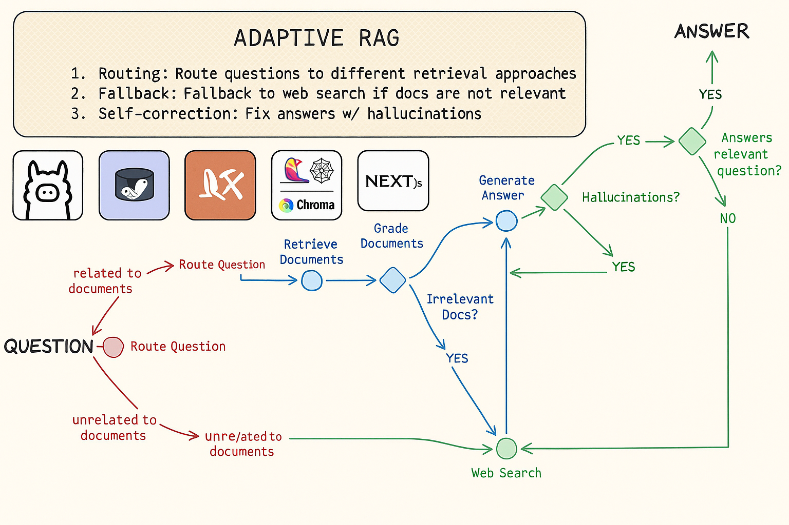
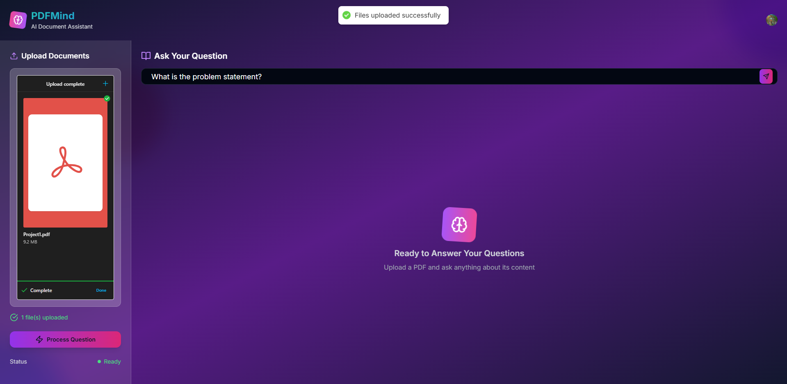
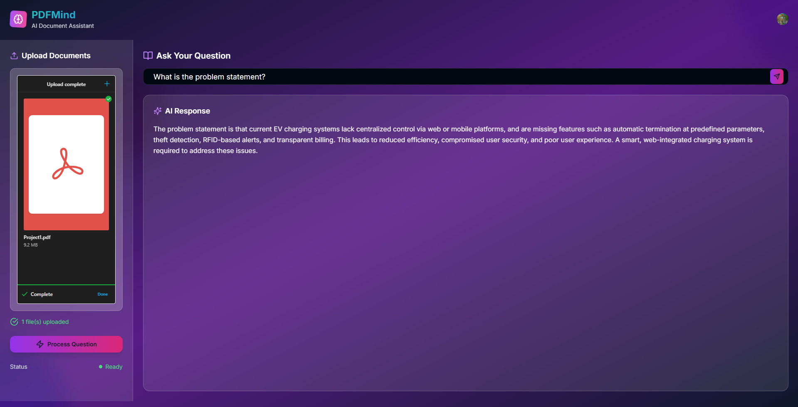

# PDFMind  - Adaptive RAG Chatbot

_RAG Ollama is an Adaptive RAG Agent web app that uses LLM to answer questions about a PDF document. The app uses a graph-based approach to answer questions. The graph is built using LangGraph._
## Architecture & Screenshots

### System Architecture


### Application Screenshots

**Asking a Question:**


**AI Response:**


The RAG technique is used is called Adaptive RAG. Why is this called Adaptive?
1. **Routing**: Route questions to different retrieval approaches
2. **Fallback**:  Fallback to web search if docs are not relevant to query
3. **Self-correction**: Fix answers w/ hallucinations or don’t address question

## Tech Stack
This monorepo has a frontend and backend. The following are the technologies used in this project:-

### Frontend
- [Next.js](https://nextjs.org/)
- [Tailwind CSS](https://tailwindcss.com/)
- [Shadcn UI](https://ui.shadcn.com/)
- [Clerk](https://clerk.dev/)

### Backend
- [Ollama](https://ollama.com/)
- [Lamma3](https://llama.meta.com/llama3/)
- [LangChain](https://www.langchain.com/)
- [LangChain Community](https://pypi.org/project/langchain-community/)
- [LangGraph](https://blog.langchain.dev/langgraph/)
- [LangSmith](https://smith.langchain.com/)
- [Chroma DB](https://www.trychroma.com/)
- [PyPDFLoader](https://python.langchain.com/docs/modules/data_connection/document_loaders/pdf/)
- [FastAPI](https://fastapi.tiangolo.com/)
- [Uppy](https://uppy.io/)

## Getting Started

### Prerequisites
- **Python 3.10+** - Download from [python.org](https://www.python.org/downloads/)
- **Node.js 18+** - Download from [nodejs.org](https://nodejs.org/)
- **Ollama** - Local LLM runtime (see installation steps below)
- **Tavily API Key** - Get from [tavily.com](https://app.tavily.com/) (for web search)
- **LangSmith API Key** - Get from [smith.langchain.com](https://smith.langchain.com/) (optional, for tracing)
- **Clerk Account** - For authentication (see setup steps below)

### Step-by-Step Installation

#### 1. Clone the Repository
```bash
git clone <your-repo-url>
cd rag-ollama
```

#### 2. Install Ollama (Required for LLM)
**Windows:**
```bash
# Option 1: Using winget (recommended)
winget install Ollama.Ollama

# Option 2: Download from https://ollama.ai/download
```

**macOS:**
```bash
brew install ollama
```

**Linux:**
```bash
curl -fsSL https://ollama.ai/install.sh | sh
```

**Start Ollama and Download Model:**
```bash
# Start Ollama service
ollama serve

# In a new terminal, download the llama3 model (4.7GB)
ollama pull llama3
```

#### 3. Backend Setup

**Install Python Dependencies:**
```bash
cd backend
pip install -r requirements.txt
```

**Create Environment File:**
Create `backend/.env` file with:
```env
TAVILY_API_KEY=your_tavily_api_key_here
```

**Optional - LangSmith Tracing:**
Replace the LangSmith API keys in `backend/main.py` (lines 32-34):
```python
os.environ["LANGCHAIN_API_KEY"] = "your_langsmith_api_key_here"
```

**Start Backend:**
```bash
# Option 1: Using the startup script
start-backend.bat

# Option 2: Manual start
cd backend && uvicorn main:app --reload --host 127.0.0.1 --port 8000
```

#### 4. Frontend Setup

**Install Node.js Dependencies:**
```bash
cd frontend
npm install
```

**Setup Clerk Authentication:**
1. Go to [clerk.dev](https://clerk.dev/) and create an account
2. Create a new project
3. Create `frontend/.env.local` file with your Clerk keys:
```env
NEXT_PUBLIC_CLERK_PUBLISHABLE_KEY=pk_test_...
CLERK_SECRET_KEY=sk_test_...
NEXT_PUBLIC_CLERK_SIGN_IN_URL=/sign-in
NEXT_PUBLIC_CLERK_SIGN_UP_URL=/sign-up
NEXT_PUBLIC_CLERK_AFTER_SIGN_IN_URL=/dashboard
NEXT_PUBLIC_CLERK_AFTER_SIGN_UP_URL=/dashboard
```

**Start Frontend:**
```bash
# Option 1: Using the startup script
start-frontend.bat

# Option 2: Manual start
cd frontend && npm run dev
```

#### 5. Quick Start (Recommended)

**Easy Setup:**
```bash
# Run the setup script (installs dependencies and creates .env files)
setup.bat

# Start both services together
start-dev.bat
```

**Individual Services:**
```bash
# Start backend only
start-backend.bat

# Start frontend only  
start-frontend.bat

# Test backend
test-backend.bat
```

#### 6. Verify Installation

**Test Backend:**
```bash
test-backend.bat
```

**Expected Output:**
```
✅ Health check: 200 - {'status': 'healthy', 'message': 'RAG Ollama API is running'}
✅ Question submission: 200 - {'status': 'success', 'question': 'What is machine learning?'}
✅ Process endpoint: 200 - {'status': 'success', 'generation': '...'}
```

### Usage

1. **Open Application:** Navigate to [http://localhost:3000](http://localhost:3000)
2. **Sign Up/In:** Create an account using the sign-in button
3. **Upload PDF:** Upload your PDF document(s) using the file upload area
4. **Ask Questions:** Type your question in the input field
5. **Process:** Click the "Process" button to get AI-powered answers
6. **View Results:** The AI will analyze your PDF and provide relevant answers

### Troubleshooting

**Common Issues:**

1. **"Processing failed" Error:**
   - Ensure Ollama is running: `ollama serve`
   - Check if llama3 model is installed: `ollama list`
   - Verify backend is running on port 8000

2. **"Connection refused" Error:**
   - Make sure backend is running: `python start_backend.py`
   - Check if port 8000 is available

3. **"Ollama not found" Error:**
   - Install Ollama properly (see step 2)
   - Add Ollama to your PATH or use full path

4. **Frontend Build Errors:**
   - Clear node_modules: `rm -rf node_modules && npm install`
   - Check Node.js version: `node --version` (should be 18+)

### File Structure
```
pdfmind/
├── backend/
│   ├── main.py              # FastAPI backend
│   ├── requirements.txt     # Python dependencies
│   ├── .env                 # Backend environment variables
│   └── temp/                # Temporary PDF storage
├── frontend/
│   ├── app/                 # Next.js app directory
│   ├── components/          # React components
│   ├── package.json         # Node.js dependencies
│   └── .env.local           # Frontend environment variables
├── assets/                  # Images and documentation
│   ├── Architecture.png     # System architecture diagram
│   ├── Asking_Question.png  # UI screenshot - asking question
│   └── Result.png           # UI screenshot - AI response
├── setup.bat               # Complete setup script
├── start-dev.bat           # Start both services
├── start-backend.bat       # Backend startup script
├── start-frontend.bat      # Frontend startup script
├── test-backend.bat        # Backend testing script
└── test_backend.py         # Python testing script
```

### Performance Notes
- **First run:** May take 2-3 minutes to process (model loading)
- **Subsequent runs:** Much faster (1-30 seconds depending on question complexity)
- **Memory usage:** ~8GB RAM recommended for llama3 model
- **Storage:** ~5GB for Ollama + llama3 model

## References & Resources

### LangSmith Trace Logs
- [Retrieval Trace Log](https://smith.langchain.com/public/8a9e2a91-94bc-4bac-ab8a-63f5b2ea046c/r) - See how the RAG retrieval process works
- [Web Search Trace Log](https://smith.langchain.com/public/5e01d27d-c218-4507-b46d-6e95302ae0d0/r) - Observe web search fallback functionality

### Documentation & Tutorials
- [LangChain Documentation](https://python.langchain.com/docs/get_started/introduction) - Complete LangChain guide
- [LangGraph Documentation](https://langchain-ai.github.io/langgraph/) - Graph-based workflows
- [FastAPI Documentation](https://fastapi.tiangolo.com/) - Modern Python web framework
- [Next.js Documentation](https://nextjs.org/docs) - React framework for production
- [Ollama Documentation](https://ollama.ai/docs) - Local LLM runtime
- [Chroma DB Documentation](https://docs.trychroma.com/) - Vector database for embeddings

### AI/ML Resources
- [Adaptive RAG Paper](https://arxiv.org/abs/2403.14403) - Research on adaptive retrieval strategies
- [RAG Survey](https://arxiv.org/abs/2312.10997) - Comprehensive RAG techniques overview
- [LangChain Hub](https://smith.langchain.com/hub) - Pre-built prompts and chains
- [Ollama Model Library](https://ollama.ai/library) - Available LLM models

### Development Tools
- [Clerk Authentication](https://clerk.dev/docs) - User authentication for web apps
- [Tailwind CSS](https://tailwindcss.com/docs) - Utility-first CSS framework
- [Shadcn/ui](https://ui.shadcn.com/) - Re-usable components built with Radix UI
- [Uppy File Upload](https://uppy.io/docs/) - File uploader library

### API Services
- [Tavily Search API](https://tavily.com/) - AI-powered web search
- [LangSmith Platform](https://smith.langchain.com/) - LLM application monitoring
- [OpenAI API](https://platform.openai.com/docs) - Alternative to local models